# Writing a Path Traced Rendering Engine from Scratch

## Foreword

I previously posted this on LinkedIn. Feel free to continue here or find it on LinkedIn [here](https://www.linkedin.com/pulse/writing-renderer-from-scratch-daniel-evans-w1y8e/?trackingId=L8yY7gxsgmajJLFWl0gWdw%3D%3D).

Here is what I ended up with, but read on to see how we ended up here.

[Watch full Video](article-assets/raytracer-export-linkedin-crf20.mp4)

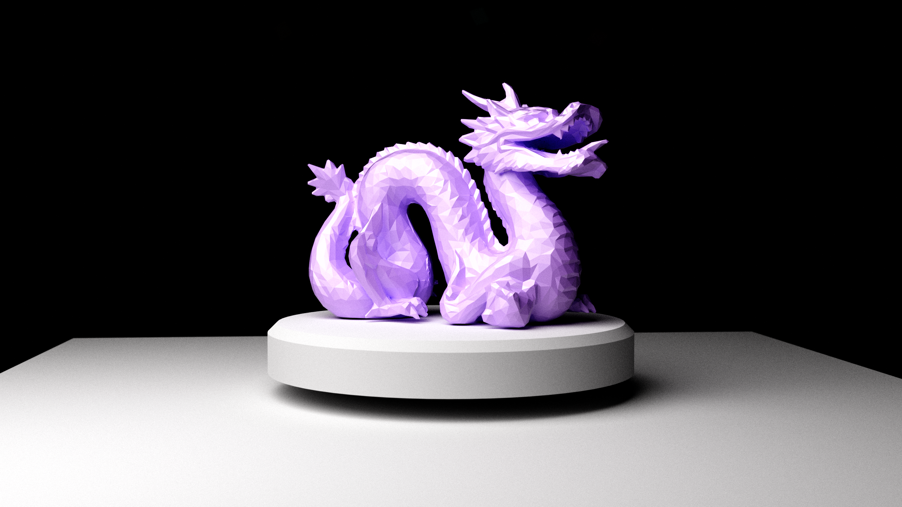

All assets shown have been created for this article.

## Introduction

Last week I posted the result of a 3D engine and path traced renderer which I developed from scratch in Python and OpenGL. This produced quite a compelling result, but I thought I would share a bit more detail on what led me to the final result and what I learned along the way.

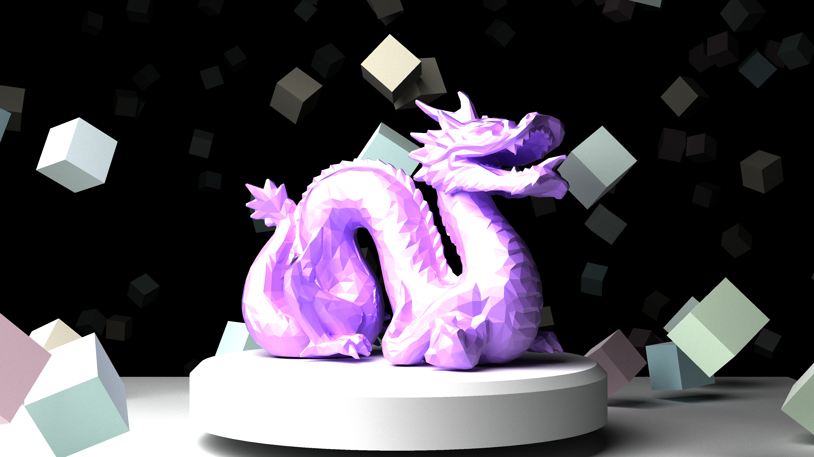

### A Quick Theory Lesson

In the real world, light is emitted from light sources, such as the sun, or a lightbulb. These rays interact electromagnetically with the materials they collide with, and are affected by atomic and microscopic properties which influence their wavelength and direction. A tiny fraction of these will be detected by a light sensor such as your eye.

We might implement this within a computer program by generating random light rays from all light sources in a scene, and then measure how much light reaches the 'sensor' we write into the software. 

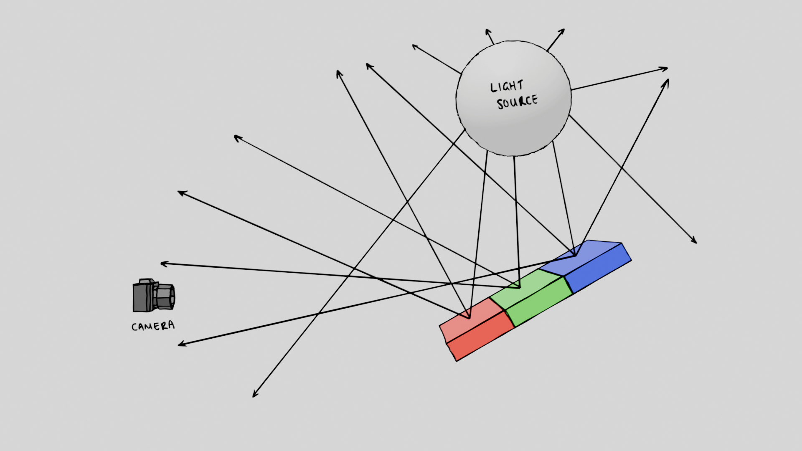

As you might've spotted, this is horribly inefficient - statistically, nearly all of the light would miss our detector. Instead, path tracers implement this in reverse - initialize a ray with no light , keep track of how it reflects and changes colour, and wait for it to eventually hit a light source - if it doesn't hit a l light source it will remain dark. This reverse approach requires two components to be tracked:

- The tone of the light as it bounces off materials.
- The incoming light from any light sources.

This method is mathematically equivalent to the real flow of light from source to sink, but takes much less processing power. And if we send one ray out to calculate each pixel of our screen, we can produce a 2D image.

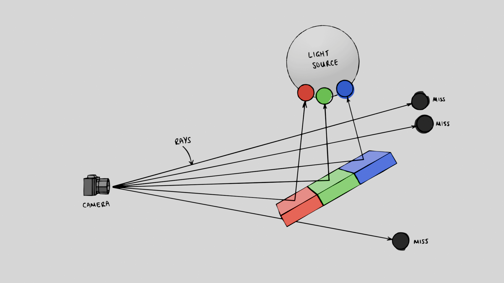 

A realistic approach to calculate the colour of the ray is to multiply the two colours. For example, a pure white light which hits a red material, would multiply to red. This is at least the case for 'diffuse' reflections which inherit the colour of the material; specular reflections tend to not pick up the colour of the material. 

Interestingly, this colour behaviour depends on electrical properties of the material, such as whether the material is a dielectric, but I'll stop there before I digress too much....

## First Steps

A common first step in writing a path tracer is to render spheres, since it provides the simplest case for testing intersections between rays and objects. To render our scene as a 2D image, we essentially just need to know which rays hit objects, and which don't.

 If we test whether there is a collision or not, and gave the colliding pixels a white colour, we could render a white circle on the screen. If we had access to things such as the material properties and the normal direction of the surface, we can use this information to bounce these rays around the scene realistically.
 
Detecting if a ray intersects a sphere in our scene involves a bit of algebra, but is fundamentally quite simple. If we draw out a ray intersecting a sphere, you'll notice it crosses the surface of the sphere twice - once on entry, and once on exit. Mathematically, this intersection is actually a quadratic equation with two roots - two real roots if it hits, or two imaginary roots if it misses, (or one repeated root if it grazes the surface...)

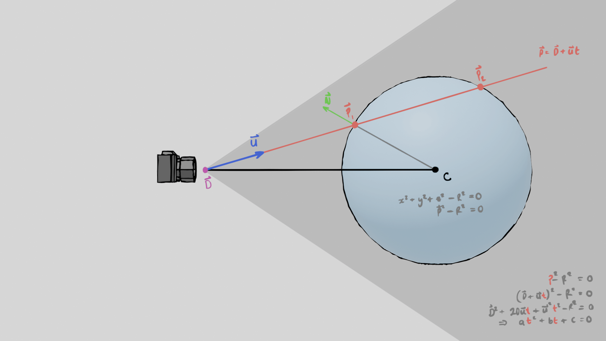 

Once we have the intersection point, calculating the normal of the surface at these points is simple - it is just the vector between the sphere's origin and the intersection. The X, Y and Z components of the normal vectors can be mapped to RGB colours which visualise the direction of the surface.

<!-- <video controls src="article-assets/01-sphere.mp4"></video> -->

[Watch the video](article-assets/01-spheres.mov)

## Diffuse Reflections & Random Sampling

For rough materials, rays that interact with the surface will bounce off in mostly random directions. You might remember that for a ray to carry any colour at all, it needs to eventually reach a light source. So, if we were to light our scene with one small light source, the probability of any single randomly-bounced ray being lit at all is quite low. 

To account for this, all possible reflection directions need to be simulated. For diffuse materials we do this by randomly reflecting our ray in all directions and averaging the result. Mathematically speaking, this Monte-Carlo random sampling approach conserves the energy of the system and produces quite a realistic-looking result without much work.

SphereWorld:

<!-- <video controls src="article-assets/02-diffuse.mp4"></video> -->

[Watch the video](article-assets/02-diffuse.mov)

## Fragment Shaders and the GPU

Suppose we have a 1920 by 1080 pixel image we want to render. If we emit a ray for each of those pixels, bounce each ray four times around the scene, and take 1000 samples per pixel to reduce noise, how much work are we actually doing?

1920 * 1080 * 4* 1000 = 8.3 billion cycles.
1920 x 1080 x 4 x 1000 = 8.3 billion cycles.

With our sphere world, and its relatively basic intersection logic, this amount of computational work is manageable and could be implemented in Python directly just fine.

However, as you can imagine, attempting to render complex scenes or animations would take orders of magnitude more work. This is where GPU programming steps in - because we are essentially performing the same calculations in parallel for millions of pixels per frame, GPUs are much better suited to this type of operation. 

An easy way to get into GPU programming is via 'shaders' within graphics libraries such as OpenGL. Shaders are essentially programs which are designed for calculating the colours of pixels in parallel on the GPU, hence why they would prove useful here.

The specific type of shader we are after is called a 'fragment shader'. Fragment shaders execute once per pixel and write RGBA colour values into a 2D texture which we can then visualise. Writing all our collision logic in a fragment shader would offer orders of magnitude better performance than CPU code, but what we gain in performance we lose in complexity and ease of debugging....

### Debugging Shaders

Shader programming is notorious for being difficult to debug. Unlike most code you'd write for the CPU, e.g. in Python, shader programs cant be debugged with the classic `print("here")` statement, let alone breakpoints. Realistically the only way to debug the program is to write information into the RGB colour channels of the output. If you haven't debugged using colours before - it is quite a challenge to debug the logic itself, but at least RGB-space is good for visualising 3D vectors.

For example, the red green and blue channels can encode normalised vectors quite nicely.

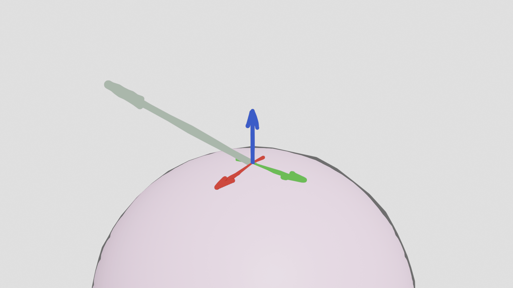

So things like checking the directions of our rays are quite straightforward. This shot confirms the rays are bouncing randomly off our rough spheres, creating a noise-like texture:

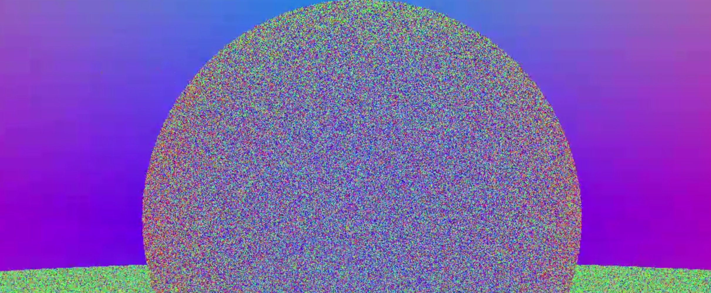

## The Triangle

While the spheres above were already looking quite realistic, their usefulness in 3D rendering is limited. Instead, triangles are the gold standard as they can be used to represent any 3D object accurately given a fine enough mesh.

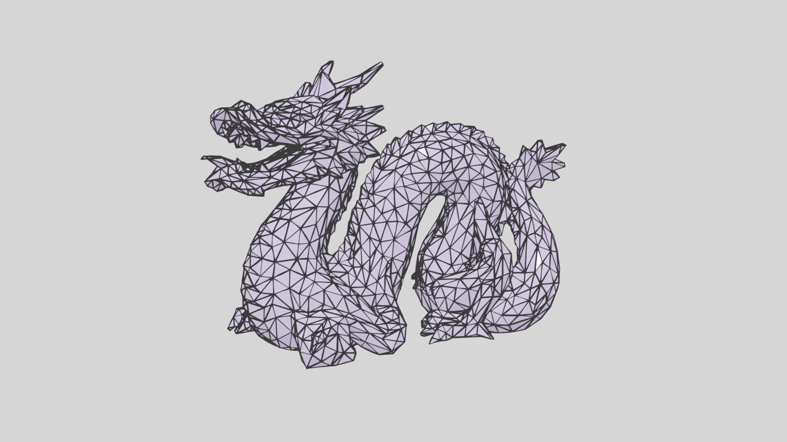

Unfortunately, our code doesn't yet know how to intersect triangles... Again, people much smarter than me have come up with quite an elegant solution. The process essentially boils down to testing if the intersection point lies on the left hand side of all three edges of the triangle. Using vector maths this becomes:

- Intersect the ray with the plane of the triangle, find intersection point P.
- Calculate the vector from triangle vertex v0 to point P: P_0.
- Cross edge v0v1 with P, test if this is points away from the surface (i.e. P_0 is on the left of v0v1)
- Repeat for all 3 sides.

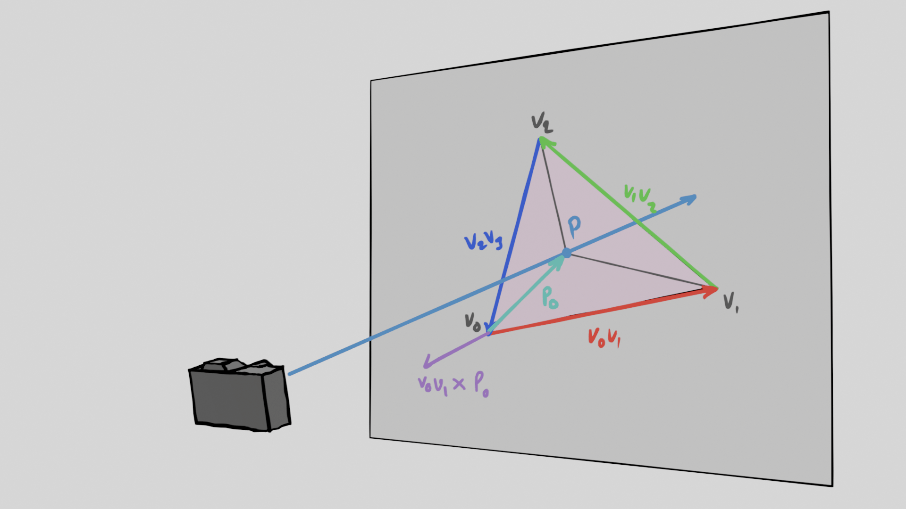

Getting the triangle collisions to run on the GPU was challenging, not least due to my complete lack of experience. Although straightforward in principle, the above equations embed quite a lot of logic and potential for errors. When I was unable to get the algorithm running in the shader, I sheepishly returned to the CPU to check if my implementation was correct.

Sure enough, the pixels on screen were looking awfully triangle-like. This confirmed my logic had been correct all along, but something was going wrong when I ported the code to the GPU.

I re-implemented the code back on the GPU, and used some spheres to visualise the vertices of the triangle in 3D space, but still nothing would show. My inexperience cost me some sanity here - but after a lot of debugging, I tracked the issue down to the memory buffers.

What am I talking about? Well, in shader programming, the application needs to pass data to the GPU's memory as raw byte buffers which are then decoded in the shader. Long story short, these bytes need to be packed correctly for the data to be read correctly. Turns out I hadn't understood the packing rules, so the bytes of my triangle vertices had been shifted and my triangle had been miles offscreen all along.

I eventually managed to get the triangle collision working on the GPU.

<video controls src="article-assets/03-triangle.mp4"></video>

The first fully loaded mesh looked quite strange due to incorrectly calculated normals

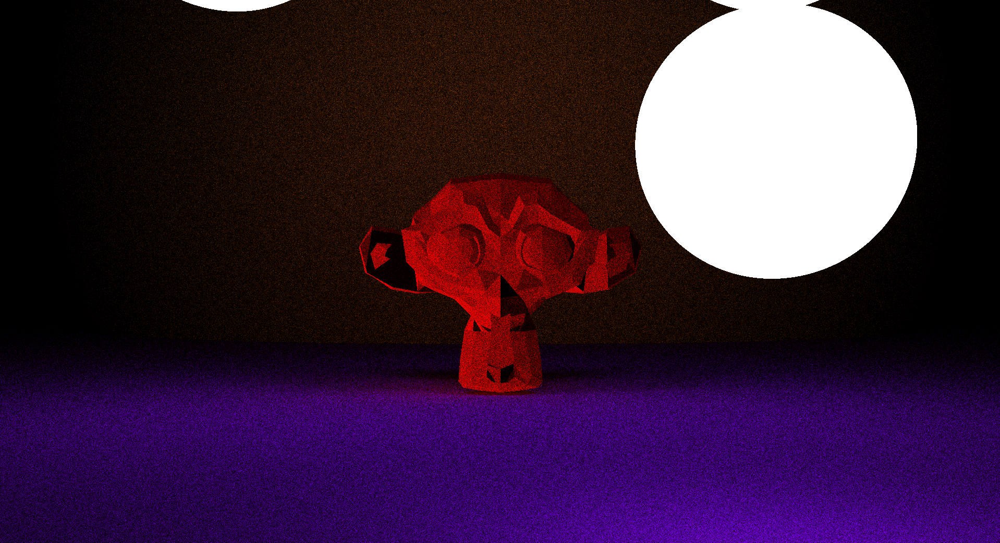

### Moving the Camera and Coordinate System Manipulation

Since we chose to write the 3D engine from scratch in Python, we have to find our own ways to debug the code. In this case, being able to move about the scene would go a long way to finding bugs. Since our camera is basically a fancy coordinate system with a field of view, writing a camera which can move hits on most of the core mathematics of working in 3D - transformation matrices and quaternions.

Thankfully, this is a solved problem in fields like 3D graphics (duh) and robotics. As I'm sure the engineers reading will remember from university, vectors, quaternions and 4x4 matrices can be used to represent coordinate systems. Matrix operations rather elegantly handle the rest:

- Transforming a point to a new coordinate system: vector-matrix multiplication.
- Rotating a vector around an axis: quaternion multiplication.

Linking up the mouse to some quaternion-based rotations gives a (very) crude moveable camera. Most of the maths here will be necessary when we start handling more mesh data, e.g. updating vertex positions, and rotating vertex normals.

DebugCam in action. And no it isn't fun to use. The path-traced shader was also swapped for something less heavy to make moving around bearable.

[Watch the video](article-assets/04-debugcam.mov)

## Camera Parameters

At this point, we've managed to generate spheres and triangles in our 3D world, as well as navigate roughly around it. However, there are a few adjustments which can be made to the camera model to add some artistic flare - such as creating depth of field effect within the scene.

In a physical camera, the depth of field effect is caused by the shutter diameter. When it approaches zero, all light hitting an area of the sensor will come from the same direction, but as it grows, the same area will receive light from a range of different angles. This creates a blur effect for anything outside the plane of focus.

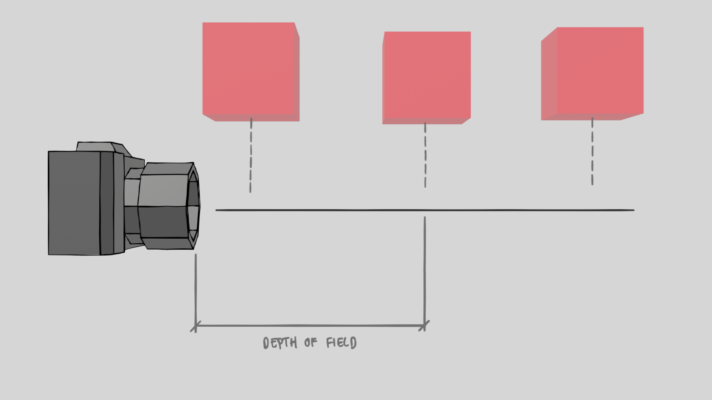

It is mathematically quite simple to implement these angles- we just randomly nudge the ray's origin depending on a strength factor and nudge the angle accordingly to maintain the plane where the target will look sharp.

This is the effect working on the GPU 

[Watch the video](article-assets/05-cam-settings-win.mp4) 

If we crank the values for the focal length and strength parameter we get some funky results.

[Watch the video](article-assets/05-cam-settings.mov)

## Bloopers

Smooth sailing you might think? While it is easy to explain the mathematics in hindsight, implementing the logic in code was a challenge. Here are some interesting outputs from along the way.

Here's what happens if we remove the per-pixel randomness from diffuse reflections within each frame.

[Watch the video](article-assets/06-rng-removal.mov)

These black rings appeared when I tried implementing light transmission through the mesh. I was very confused, but eventually realised it is a floating point precision artefact.

[Watch the video](article-assets/07-fp-precis.mov)

And finally this screen tearing effect appeared when I pushed the renderer to high resolutions.

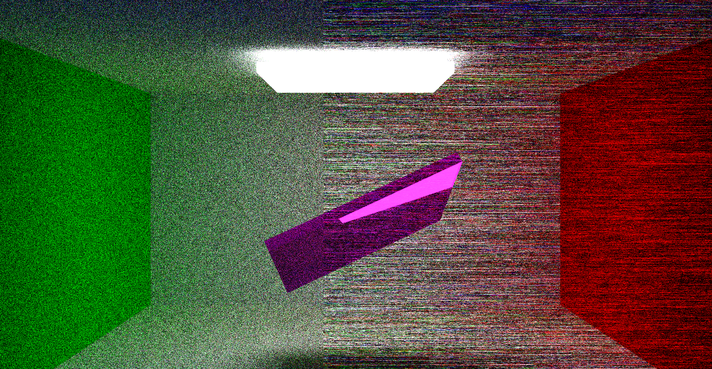

On this last one, I had hacked at some Windows registry settings and my GPU would now flash red or blue randomly throughout the day. With that in mind I had to make a tough decision.

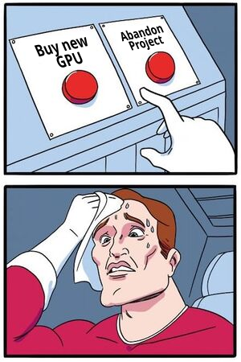

I came back to the project a year later and figured out that it had just been an integer overflow all along...

## The Return

At this point, the project was left abandoned for over a year. The engine had come a long way, but it hadn't actually produced anything worthwhile - so my goal now was to produce an animated render comparable to professional grade software. The problem with this was that I wasn't keen on running my PC at full speed for 6 months - the performance was terrible.

Regardless, I fixed by integer overflow issue set up a high resolution test scene to get an idea of how many cycles each frame would need. After an hour we've done 500 cycles of our 100-triangle scene at 1920x1080, but this render time didn't bode well for a higher quality render...

[Watch the video](article-assets/09-monkey.mov)

The performance issues stemmed from the fact that the triangle collision algorithm scaled linearly with triangle count. A 100x increase in triangle count, combined with a 100 frame animation would be about 10,000 times more work. This would take months to render, not to mention hundreds of GBP in electricity costs.

## Optimization

Fundamentally, path traced renderers are actually quite simple. The difficulty in designing these properly primarily comes through optimization.

### Bounding Volume Hierarchy 

The most costly part of the algorithm is knowing which triangle the ray actually collides with. A quick way to reduce the number of triangle checks is to ignore any triangles the ray is nowhere near. By grouping triangles into a virtual bounding boxes, we can trade potentially thousands of triangle collision checks for a few cheap bounding box intersection checks: if the ray doesn't cross the bounding box, don't bother checking the triangles within it. 

I had implemented this so far by wrapping one bounding box around each mesh. If the ray doesn't pass through a mesh's bounding box, skip all collisions with that mesh. If the mesh occupies say, 30% of the screen, 70% of the rays might be cheap to calculate - nice.

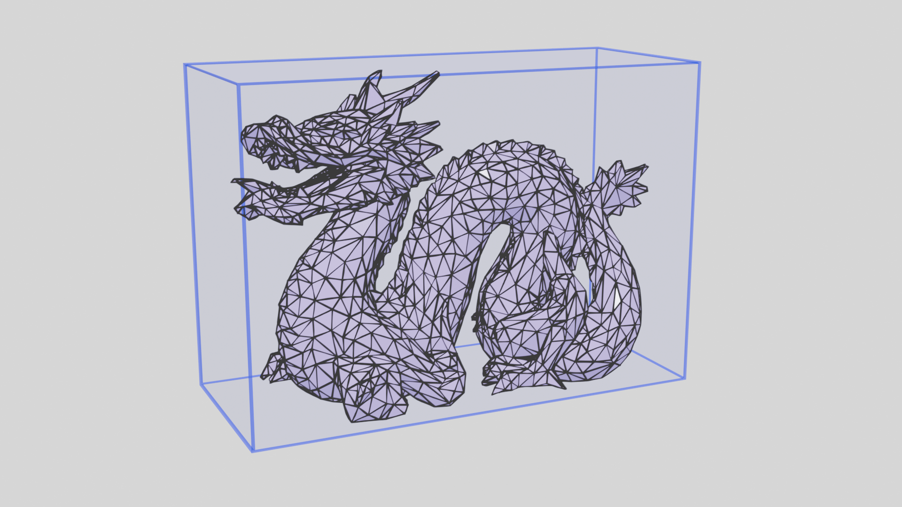

The efficacy of this approach is limited. The more effective approach is to use this method again and again recursively *within* the mesh. For example, if we split a mesh into left and right triangle groups, with a 1000 triangle mesh, instead of 1000 triangle collisions we would calculate only 500, plus two bounding box checks, one for each side - a 50% cost reduction per ray. Implementing this recursively offers even more gains, by splitting each half into two halves and so on. Notice that in between each step we shrink the bounding box down to the new set of vertices.

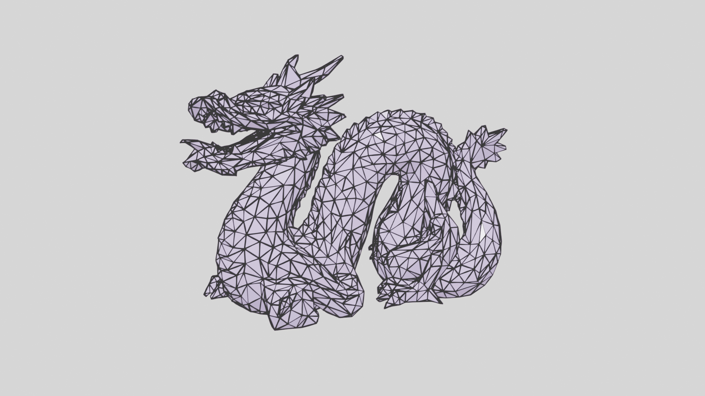

This recursive structure is called a Bounding Volume Hierarchy. This is essentially a *graph* of bounding boxes we can efficiently traverse to resolve the 10 triangles we should check, out of 10,000, in exchange for 10-20 cheap bounding box checks. 

Visualising the number of bounding box collisions with the new algorithm is quite interesting. For just 5-10 bounding box checks we are probably reducing the number of triangles checked for each ray from 10,000 to 5-10, i.e. from 10,000 collision calculations to 20-ish, a 3 orders-of-magnitude improvement. 

In the background I'd prepared a more interesting looking scene for some benchmarking. Ignore the blue-ness - I still need to learn about tone mapping and HDR images...

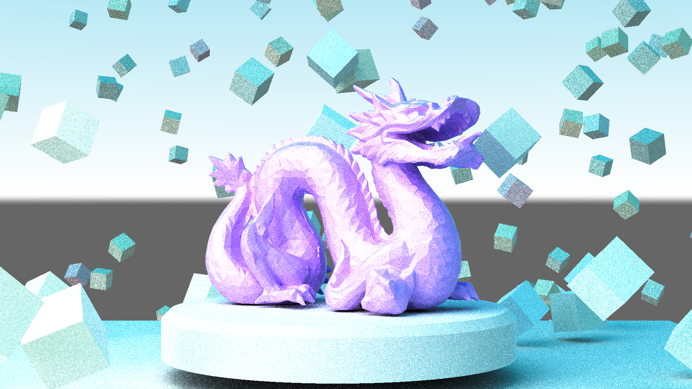

For the first rays emitted, we can visualise the number of bounding box collisions performed to see how much work goes into each pixel. The dragon mesh is 10,000 triangles for reference, so roughly 10 bounding box checks is massively more efficient. 

### Python Optimization

Although the final render was definitely GPU-limited, I used this project to test Python's numerical computing performance. Who knows, maybe it could be come a real-time renderer...?

Jokes aside, the choice of Python for a 3D graphics project might seem strange. Conventional wisdom would probably tell you that Python is too slow, and if you were to implement all of the necessary matrix operations from scratch - you'd be correct. Thankfully however, modern Python has two major features which solve most of these performance issues:

- Low-level numerical libraries (Numpy)
- Just-In-Time compilation (Numba)

Numpy's vectorisation of mathematical operations makes it orders of magnitude more efficient than pure Python at large matrix operations, such as manipulating the vertices of thousands of triangles at once. However, a lesser known fact is that Numpy's performance in Python can be enhanced further through Just-In-Time (JIT) compilation using `Numba`. The `@jit` and `@jitclass` decorators essentially compile Python functions and classes to native machine code, and giving the performance of low-level languages to performance to custom Python code. 

The improvement of JIT compilation was night and day - albeit I'll concede we are GPU bottlenecked so to claim a measurable benefit is dubious. Regardless, this approach massively improved the animation engine's performance - remapping all the vertices and vertex normals of a mesh to a new coordinate system went from tens of seconds to a few milliseconds.

## Final Stretch

After some major optimizations to the collision checking algorithm, more complex models would now render in a reasonable amount of time. We can now render this scene in just 5 minutes to test if things are working.

[Watch the video](article-assets/09-dragon-anim-1.mp4)

I then prepared a 4k static shot, and a 3 second 2560x1440 animation. But after timing a few passes of one frame on my home PC I realised the entire animation was going to take a couple of weeks to render... I'll remind you that while all this is running my computer becomes unusable - so instead I divvied up the work across a few 4070 Ti servers for around 6 days of total render time.

Mixing in some HDR postprocessing we end up with the final result shown at the start.

The amount of computing going on here is quite ridiculous when you think about it. The 4k scene requires 238 billion ray casts, and the video took 7.1 trillion.

## Final Thoughts

While intimidating at first, writing a path tracer and 3D engine from scratch showed me how much of computer graphics is built on rather simple mathematics. The real complexity comes not from the equations themselves, but from making them run efficiently. Implementing optimizations such as the Bounding Volume Hierarchy made it clear how good performance hinges on good algorithm design.

It was interesting to see how far Python can be pushed when paired with the right tools. Libraries like NumPy and Numba close much of the performance gap to lower-level languages while benefiting from Python's ease of development.

As someone with no prior experience in the field, it’s still a bit unbelievable how hardware accelerators like GPUs are orders of magnitude faster than general-purpose CPUs when given the right problem. Seeing that difference first hand really drives home why the market for hardware acceleration in AI computing these days is so enormous.

This was an interesting experience overall, but next time I'd probably tackle the 3D engine and rendering separately... My GPU is also glad the abuse is over.